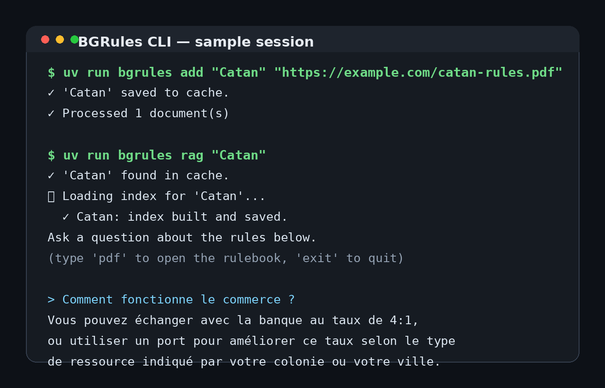
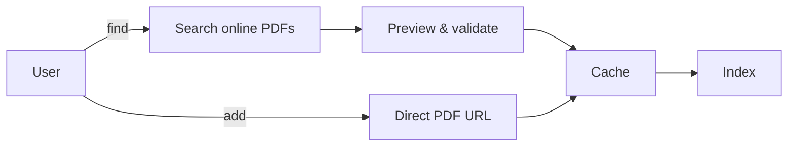
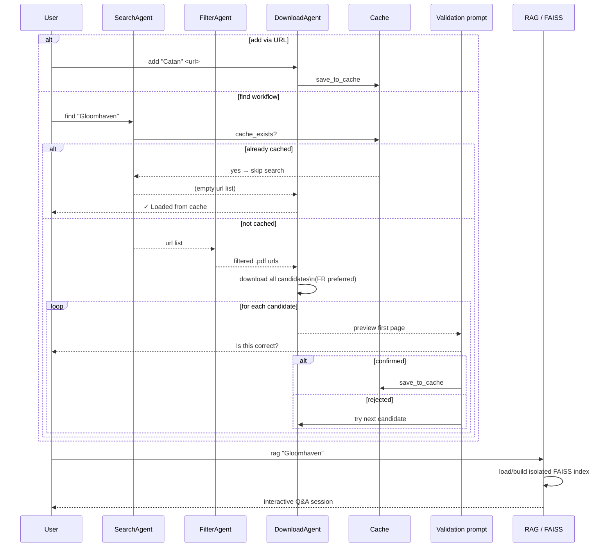
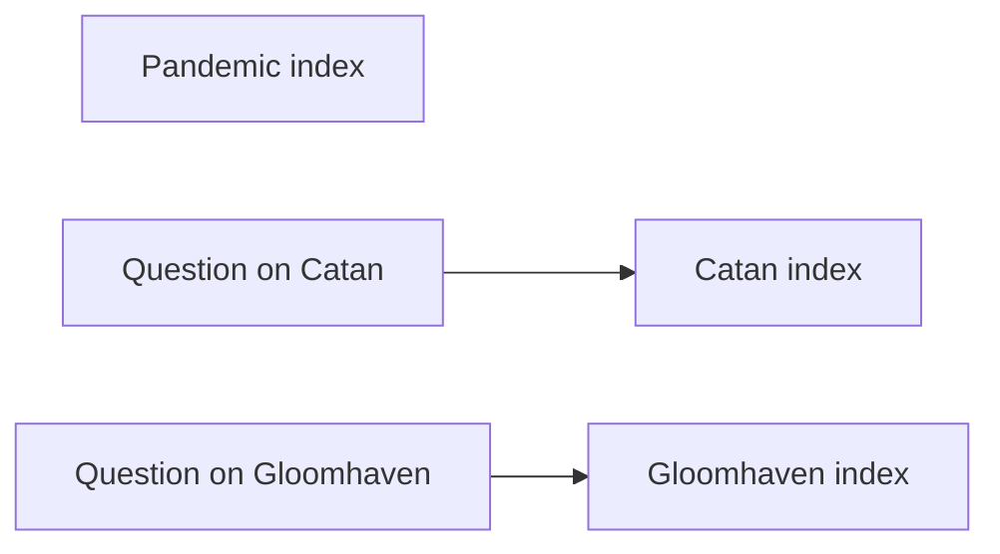

# BGRules

[](https://www.python.org/)
[](https://typer.tiangolo.com/)
[](https://python.langchain.com/)
[](https://github.com/facebookresearch/faiss)
[](https://ollama.com/)

> **Stop reading rulebooks. Start querying them.**

Local CLI to find, add, cache, index, and query board game rulebooks with a per-game RAG pipeline.

## Overview

BGRules helps you build a local rulebook assistant for board games:

- search and download rule PDFs
- add your own rulebooks from a direct PDF URL
- cache documents locally
- build isolated FAISS indexes per game
- chat with the rules through Ollama

The per-game indexing model matters: querying one game keeps the retrieval scope limited to that game's PDF, so answers do not bleed across unrelated games.


## How it works (at a glance)


## Screenshot



## Features

- DuckDuckGo-based PDF discovery for board game rules
- domain filtering for publishers and trusted rule sources
- French-first download preference, with English fallback
- interactive validation when using `find`
- direct PDF import with `add`
- local cache for downloaded rulebooks
- isolated FAISS index per game
- all-games RAG mode when no game is specified
- `pdf` shortcut during a single-game RAG session to open the cached rulebook
- Ollama model status and session-level LLM override


## Two ways to add a game



## Project structure

```text
BGRules/
├── api/
│   └── server.py
├── bgrules/
│   ├── __init__.py
│   ├── agents.py          # Search / filter / download / parse pipeline
│   ├── config.py          # Global configuration
│   ├── db.py              # SQLAlchemy helpers
│   ├── main.py            # CLI entry point (Typer)
│   ├── ollama.py          # Ollama helpers and model status
│   ├── rag.py             # FAISS + retrieval + interactive QA
│   ├── scraper.py         # Cache, download, and scraping helpers
│   ├── cache/             # Local PDF cache (auto-created, git-ignored)
│   └── faiss_index/       # Local FAISS indexes (auto-created, git-ignored)
├── docs/
│   └── screenshot.png
├── langflow/
│   └── flow.json
├── ui/
│   └── steamlit_app.py
├── pyproject.toml
└── README.md
```


## Architecture diagram

```mermaid
flowchart LR
    A[User: game name] --> B[SearchAgent]
    A2[User: PDF URL (add)] --> D[DownloadAgent]

    B -->|cache hit| D
    B -->|urls| C[FilterAgent — .pdf only]
    C -->|filtered urls| D

    D -->|all valid candidates\nFR first, then EN| V[Interactive validation]
    V -->|confirmed| Cache[(bgrules/cache/)]

    Cache -->|pdf bytes| E[ParserAgent]
    E -->|text| I[FAISS index\nper game]

    I --> J[(faiss_index/<stem>/)]
    J -->|reloaded on next run| I

    I -->|retriever| R[RAG Q&A chain]
    R --> LLM[Ollama LLM]
    LLM --> U[User answer]
```

## Pipeline sequence



## Installation

### 1. Install Ollama and pull a model

```bash
ollama pull llama3
ollama serve
```

### 2. Install `uv`

```bash
curl -Ls https://astral.sh/uv/install.sh | sh
```

### 3. Install dependencies

```bash
uv sync
```

## Quick start

```bash
# Search, preview, validate, and cache a rulebook
uv run bgrules find "Pandemic"

# Add a rulebook directly from a PDF URL
uv run bgrules add "Catan" "https://example.com/catan-rules.pdf"

# Ask questions about one cached game
uv run bgrules rag "Pandemic"

# Query across all cached games
uv run bgrules rag
```


## How RAG works


## CLI reference

```text
bgrules
├── find <game>              Search, download, preview, validate, and cache a rules PDF
│     --debug                Enable verbose debug output
├── add <game> <url>         Download a rules PDF from a direct URL and add it to the cache
│     --debug                Enable verbose debug output
├── list                     List all cached games (alphabetically)
├── rag [game]               Interactive RAG chat
│                            Omit the game name to query all cached games
│                            Type 'pdf' during a single-game session to open the rulebook
│
├── cache
│   ├── clear                Delete all cached PDFs and the cache index
│   └── rebuild              Rebuild the cache index from PDFs already on disk
│
└── llm
    ├── status               Show current LLM / embeddings models and Ollama availability
    ├── set <model>          Override the LLM model for this session
    └── faiss-clear          Delete FAISS index(es)
          --game / -g <game> Delete only that game's index (deletes all if omitted)
```

### `find`

Searches for a rulebook online, downloads candidate PDFs, opens them for validation, and caches the confirmed file.

```bash
uv run bgrules find <NomDuJeu>
```

Example:

```bash
uv run bgrules find "Gloomhaven"
uv run bgrules find "Catan" --debug
```

### `add`

Adds a game from a direct PDF URL.

```bash
uv run bgrules add <NomDuJeu> <url>
```

Parameters:

- `<NomDuJeu>`: local game name used in the cache
- `<url>`: direct link to a PDF file

What it does:

- downloads the PDF
- validates that the response looks like a real PDF
- saves it to the local cache
- clears the existing FAISS index for that game, if any
- pre-processes the document so it is ready for RAG

Example:

```bash
uv run bgrules add "Catan" "https://example.com/catan-rules.pdf"
```

> The URL must point directly to a PDF file, not to an HTML page with a download button.

### `rag`

Starts an interactive question-answering session over cached rulebooks.

```bash
uv run bgrules rag [NomDuJeu]
```

Example:

```bash
uv run bgrules rag "Pandemic"
uv run bgrules rag
```

### `list`

Lists all cached games.

```bash
uv run bgrules list
```

### `cache clear`

Deletes cached PDFs and the cache index.

```bash
uv run bgrules cache clear
```

### `cache rebuild`

Rebuilds the cache index from PDFs already stored on disk.

```bash
uv run bgrules cache rebuild
```

### `llm status`

Displays the current LLM and embeddings configuration and checks Ollama availability.

```bash
uv run bgrules llm status
```

## Usage examples

### Search and cache a game

```bash
uv run bgrules find "Gloomhaven"
```

### Add a game from a direct URL

```bash
uv run bgrules add "Catan" "https://example.com/catan-rules.pdf"
```

### Open a single-game RAG session

```bash
uv run bgrules rag "Catan"
```

### Query across every cached game

```bash
uv run bgrules rag
```

### Typical workflow

```bash
uv run bgrules add "Catan" "https://example.com/catan-rules.pdf"
uv run bgrules rag "Catan"
```

Then ask something like:

```text
Comment fonctionne le commerce ?
```


## Per-game isolation




## How indexing works

- each cached game is mapped to a stable local filename
- each game gets its own FAISS index
- the index is built on the first `rag` call if it does not already exist
- when using `add`, the previous index for that game is invalidated to avoid stale retrieval
- querying a specific game uses only that game's index
- querying without a game merges all cached indexes in memory

## Stack

- **Typer** for the CLI
- **LangChain** for retrieval and prompting
- **FAISS** for vector storage
- **Ollama** for local LLM and embeddings
- **PyMuPDF** for PDF parsing
- **DuckDuckGo Search** for PDF discovery
- **UV** for dependency and environment management

## Notes

### Cached files

Rulebooks are stored locally under the package cache directory. FAISS data is also stored locally.

### Model changes

Changing the LLM does not require rebuilding indexes. Changing the embeddings model does.

### Git-ignored paths

```text
bgrules/cache/
bgrules/faiss_index/
```

## Roadmap ideas

- local file import: `add "Catan" ./rules.pdf`
- support for non-direct URLs by discovering the actual PDF link
- richer metadata per cached rulebook
- web UI polish for the Streamlit app
