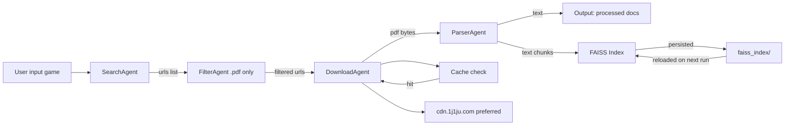
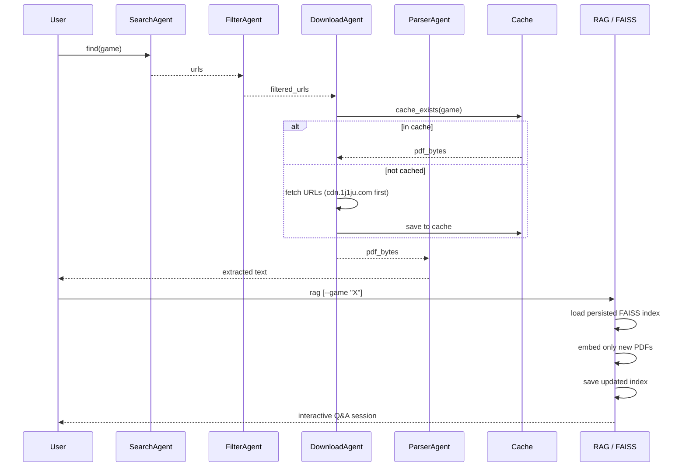

# Board Game Rules PDF Retriever (Legal Only)

Local AI system to find, cache, and chat with board game rules using RAG.

## Project structure
```
boardgame-ai/
├── bgrules/
│   ├── agents.py          # Agents logic (search, filter, download, parse)
│   ├── scraper.py         # Scraping helpers, cache management, lang detection
│   ├── rag.py             # RAG pipeline (FAISS index, embeddings, Q&A chain)
│   ├── config.py          # Global config (debug mode, allowed domains)
│   ├── db.py              # SQLAlchemy document store
│   ├── main.py            # CLI entry point (Typer)
│   └── cache/             # Downloaded PDFs (auto-created)
│       └── .cache_index.json  # Hash → game name mapping
├── faiss_index/           # Persisted FAISS vector index (auto-created)
│   └── .indexed_stems.json   # Tracks which PDFs are already embedded
├── data/
├── pyproject.toml
└── README.md
```

## Architecture Diagram


## Pipeline sequence


## Stack
- LangChain
- Ollama (local LLM — `llama3`)
- FAISS (local vector store)
- UV (package + env manager)
- DuckDuckGo Search
- PyMuPDF

## Features
- Searches for official/legal board game rule PDFs
- Filters results using domain whitelist
- Prefers French PDFs, falls back to English
- Downloads and caches PDFs locally in `bgrules/cache/`
- Persists FAISS vector index to disk — embeddings are only computed once per PDF
- Incrementally updates the index when new games are added
- Listing cached games alphabetically via CLI (`bgrules list`)
- Interactive RAG chat session scoped to all cached games or a single game

## Usage examples
```bash
# Search and download rules
uv run bgrules find "Gloomhaven"
uv run bgrules find "Catan" --debug

# Cache management
uv run bgrules list                  # list cached games (alphabetical)
uv run bgrules cache-rebuild         # rebuild index from existing PDFs
uv run bgrules cache-clear           # delete all cached PDFs and index

# RAG chat
uv run bgrules rag                   # chat over all cached PDFs
uv run bgrules rag --game "Scythe"   # download Scythe if needed, then chat
```

## Requirements
- Python 3.10+
- Ollama installed and running (https://ollama.com)
- UV installed (https://github.com/astral-sh/uv)

## Setup

### 1. Install Ollama and pull the model:
```bash
ollama pull llama3
ollama serve
```

### 2. Install uv:
```bash
curl -Ls https://astral.sh/uv/install.sh | sh
```

### 3. Create env and install dependencies:
```bash
uv sync
```

### 4. Run:
```bash
uv run bgrules find "Pandemic"
uv run bgrules rag --game "Pandemic"
```

## Notes on the FAISS index

The vector index is stored in `faiss_index/` and persists between runs. A companion file `.indexed_stems.json` tracks which PDFs have already been embedded, so subsequent calls to `bgrules rag` skip re-embedding and load the index instantly.

When a new game is added via `bgrules find`, it will be embedded and appended to the index on the next `bgrules rag` call — no need to rebuild from scratch.