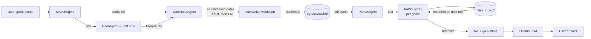
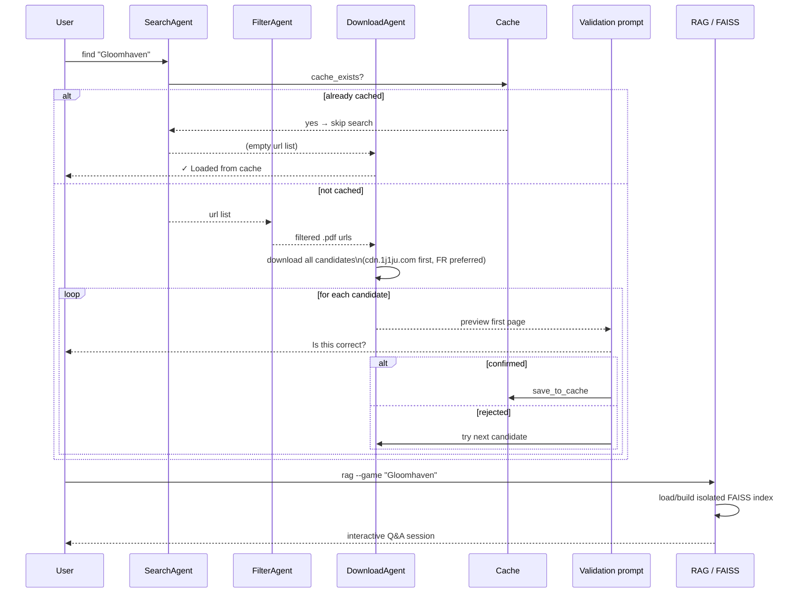

# Board Game Rules PDF Retriever

Local AI system to find, cache, and chat with board game rules using RAG.

## Project structure

```
boardgame-ai/
├── bgrules/
│   ├── agents.py          # Agents pipeline (search, filter, download, parse)
│   ├── scraper.py         # Scraping helpers, cache management, lang detection
│   ├── rag.py             # RAG pipeline (per-game FAISS indexes, embeddings, Q&A chain)
│   ├── ollama.py          # Ollama interaction helpers (model listing, selection, status)
│   ├── config.py          # Global config (domains, model names, paths)
│   ├── db.py              # SQLAlchemy document store
│   ├── main.py            # CLI entry point (Typer)
│   └── cache/             # Downloaded PDFs (auto-created, git-ignored)
│       └── .cache_index.json  # Hash → game name mapping
└── faiss_index/           # Per-game FAISS vector indexes (auto-created, git-ignored)
    └── <md5_stem>/        # One sub-folder per cached game
```

## Architecture diagram



## Pipeline sequence



## CLI reference

```
bgrules
├── find <game>              Search, download (with preview & validation), and cache rules PDF
│     --debug                Enable verbose debug output
├── list                     List all cached games (alphabetically)
├── rag                      Interactive RAG chat over all cached games
│     --game / -g <game>     Scope the session to a single game (strict isolation)
│
├── cache
│   ├── clear                Delete all cached PDFs and the cache index
│   └── rebuild              Rebuild the cache index from existing PDFs on disk
│
└── llm
    ├── status               Show current LLM/embeddings models and Ollama availability
    ├── set <model>          Override the LLM model for this session
    └── faiss-clear          Delete FAISS index(es)
          --game / -g <game> Delete only that game's index (deletes all if omitted)
```

## Usage examples

```bash
# Find and cache rules (interactive PDF validation)
uv run bgrules find "Gloomhaven"
uv run bgrules find "Catan" --debug

# Browse cached games
uv run bgrules list

# RAG chat — single game (strict, no cross-game bleed)
uv run bgrules rag --game "Gloomhaven"

# RAG chat — all cached games merged
uv run bgrules rag

# Cache management
uv run bgrules cache clear
uv run bgrules cache rebuild

# LLM / embeddings management
uv run bgrules llm status
uv run bgrules llm set mistral

# FAISS index management
uv run bgrules llm faiss-clear                    # clear all
uv run bgrules llm faiss-clear --game "Gloomhaven"  # clear one game
```

## Stack

- **LangChain** — RAG chain, prompt templates, LCEL
- **Ollama** — local LLM and embeddings (default: `llama3`)
- **FAISS** — local vector store, one index per game
- **PyMuPDF** — PDF text extraction and preview
- **DuckDuckGo Search** — rulebook PDF discovery
- **UV** — package and environment manager
- **Typer** — CLI with sub-command groups

## Features

- Searches for board game rule PDFs via DuckDuckGo
- Domain whitelist covering major publishers (Asmodee, Stonemaier, Fantasy Flight, IELLO, Matagot, …) and rule aggregators (1j1ju, BoardGameGeek, …)
- Prefers French PDFs, falls back to English
- Downloads **all valid candidates**, shows a first-page preview, and asks for confirmation before caching — skips to the next candidate if rejected
- Per-game isolated FAISS indexes: scoping `rag --game X` guarantees answers never bleed across games
- All-games mode merges individual indexes in memory without mixing them on disk
- LLM and embeddings models are fully decoupled — switching LLM has no impact on existing FAISS indexes; switching embeddings model requires `llm faiss-clear`
- `llm status` detects which Ollama models are actually installed and warns if a configured model is missing
- `llm set` overrides the LLM for the current session; permanent change via `config.py`

## Setup

### 1. Install Ollama and pull a model

```bash
ollama pull llama3
ollama serve
```

### 2. Install uv

```bash
curl -Ls https://astral.sh/uv/install.sh | sh
```

### 3. Install dependencies

```bash
uv sync
```

### 4. Run

```bash
uv run bgrules find "Pandemic"
uv run bgrules rag --game "Pandemic"
```

## Notes

### FAISS indexes

Each game gets its own isolated index under `faiss_index/<md5_stem>/`. The index is built on the first `rag` call and reloaded instantly on subsequent runs. Switching the embeddings model invalidates existing indexes — run `bgrules llm faiss-clear` first.

### Changing models

| Change | Action required |
|---|---|
| `LLM_MODEL` in `config.py` | None — takes effect immediately |
| `EMBEDDINGS_MODEL` in `config.py` | Run `bgrules llm faiss-clear` then re-run `rag` |

### Git-ignored paths

```
bgrules/cache/
faiss_index/
```