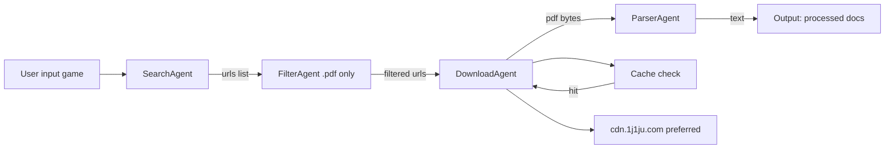
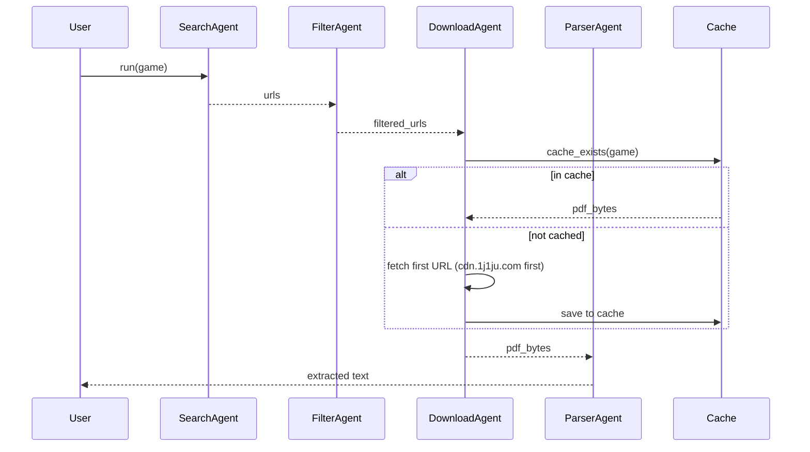

# Board Game Rules PDF Retriever (Legal Only)

Local AI system to find and chat with board game rules.

## Project structure
```
boardgame-ai/
├── app/
│   ├── agents.py          # Agents logic (search, filter, download, parse)
│   ├── scraper.py         # Scraping helper + cache and lang detection
│   └── main.py            # Orchestration (pipeline + CLI)
├── api/
├── ui/
├── data/
├── langflow/
├── pyproject.toml
└── README.md
```

## Architecture Diagram


## Pipeline sequence


## Stack
- LangChain
- Ollama (local LLM)
- UV (package + env manager)
- DuckDuckGo Search
- PyMuPDF

## Features
- Searches for official/legal board game rule PDFs
- Filters results using LLM + domain whitelist
- Downloads PDFs
- Extracts text

## Requirements
- Python 3.10+
- Ollama installed (https://ollama.com)
- UV installed (https://github.com/astral-sh/uv)

## Setup
### 1. Install Ollama and run:
```
ollama run llama3
```

### 2. Install uv:
```
curl -Ls https://astral.sh/uv/install.sh | sh
```
### 3. Create env + install dependencies:
```
uv sync
```
### 4. Run:
```
python main.py
```